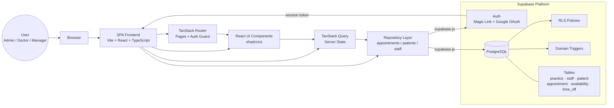

```mermaid
flowchart LR

User((User\nAdmin / Doctor / Manager))

User --> Browser[Browser]

Browser --> SPA[SPA Frontend\nVite + React + TypeScript]

%% SPA internal layers

SPA --> Router[TanStack Router\nPages + Auth Guard]
SPA --> UI[React UI Components\nshadcn/ui]
SPA --> Query[TanStack Query\nServer State]
SPA --> Repos[Repository Layer\nappointments / patients / staff]

Router --> UI
UI --> Query
Query --> Repos

%% Supabase Platform

Repos -->|supabase-js| Auth
Repos -->|supabase-js| Postgres

subgraph SupabasePlatform[Supabase Platform]
  Auth[Auth\nMagic Link + Google OAuth]
  Postgres[(PostgreSQL)]
  RLS[RLS Policies]
  Triggers[Domain Triggers]
  Tables[Tables\npractice · staff · patient\nappointment · availability · time_off]
end

Postgres --> RLS
Postgres --> Triggers
Postgres --- Tables

Auth -->|session token| SPA
```
